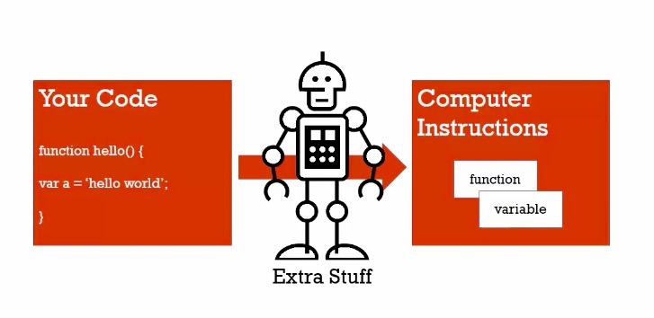
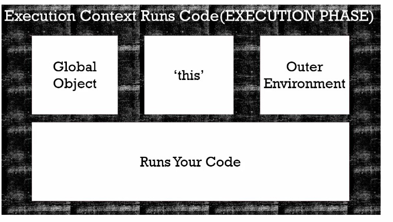
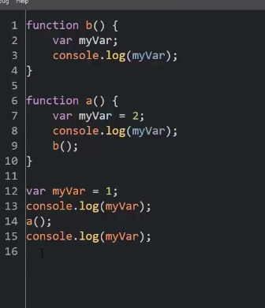
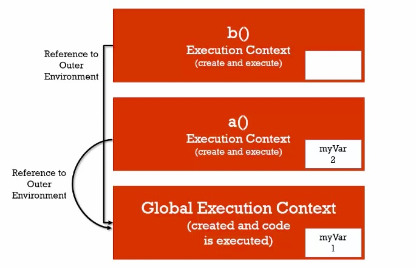

## Conceptual Aside

This is where we will learn a concept that's foudamental to what we're gonna learn thoughtout the course.

* Syntax Parsers
* Execution Contexts
* Lexical Environments

**Syntax Parsers : A program that reads your code and determines what it does and it its grammar is valid**

Your code isn't magic. Someone else wrote a program to translate it for the computer.



**Lexical Environment: Where something sits physically in the code you write**

'Lexical' means 'having to do with words or grammar'. A lexical environment exists in programming languages in which **where** you write something is important.

**Execution Context: A wrapper to help manage the code that is running**

There are lots of lexical environments. Which one is currently running is managed via execution contexts. It can contain things **beyond** what you've written in your code.


## Conceptual Aside

* Name/Value Pairs
* Objects

**Name/Value Pairs: A name which maps to a unique value**

The name may be defined more than once, but only can have one value in any given **context**.

That value may be more name/value pairs.

**OBJECT: A collection of name value pairs**

The simplest definition when talking about Javascript.


```
Don't think object as too deep, it's just that simple...
```


## The global environment and the global object


What global execution context creates for you


window object is the global object for you if you running js in broswer, there will allways be a global object.


**Global : "Not inside a function" **

Don't think deeper than that...


> In js, when you create variable and function that are not inside other functions. those functions and variables get attached to the global object.


## The execution context: Creation and 'Hoisting'

```
b();
console.log(a);

var a = 'Hello World!';

function b() {
  console.log('Called b!');
}
```

In other programing languages, above will throw an error

console.log(a)  --->  undefined

if you don't have a defined, you will get error...

This is called hositing, online definitions are wrong. to understand that, let's look at execution context.


> It's not actully moving code to the top of the page, **before** your code get executed **line by line**, the Javascript engine has set aside space for the variables and all of the functions you wrote. however, when it comes to variables, it's little bit different.

functions are sitting in their memory entirely, but variables get the initial undefined value.


## Conceptual Aside

Javascript and 'undefined'


error: a is not defined and a is undefined, they are not the same thing.

undefined: not just string, it's a **special value** that tells javscript a varivblvae's valuee has not been set yet. to prove it, see below code. undefined is a value initially set by javascirpt engine.

var a;
console.log(a);

```
if (a === undefined){
  console.log('a is undefined!');
}
else {
  console.log('a is defined!');
}
```

```
WARNING: a = undefined; 
```

don't do this. it will help you in your debugging to let undefined means I, as a programmer, never set this value.


## The execution context: code execution




## Conceptual Aside

* Single threaded
* Synchronous execution

**Single threaded: One command at a time**

Under the hood of the browser, maybe not

**Synchronous execution: one at a time**

And in order...


## Function invocation and the execution stack

**Invocation: running a function**

In javascript, by using parentthesis()


When you invocate the function, a new execution context is created and stacked on top of the previous one(in this case, the global execution context). 


Whichever one is on top is the one that's actully running. when the top stack finished running, it will **pop off** the stack, and go back to the next one. all the way up to the global one.


Function's lexical location don't matter.


> Whatever on the top of the stack is currently running, line by line, synchronously.


## Functions, context, and variable environments


**Variable environments: where the variables live**

And how they relate to each other in memory

Let's take a look at the exsample code below

```
function b(){
  var myVar;
}

function a(){
  var myVar = 2;
  b();
}

var myVar = 1;
a();
```




**Move ahead if you understand the above code**


## The scope chain




Let's go back to lexical enviroment, b funciton lexically sits at the global execution context. the outer enviroment is depend on where b funciton sits lexically.


## Scope, ES6, and let


 
### let

```
if(a>b){
  let c = ture;
}
```


## What about asynchronous callbacks?


Asynchronous: more than one at a time


**JS won't look at the event Queue until the stack is empty**

not fully understand yet 1:30~1:48


