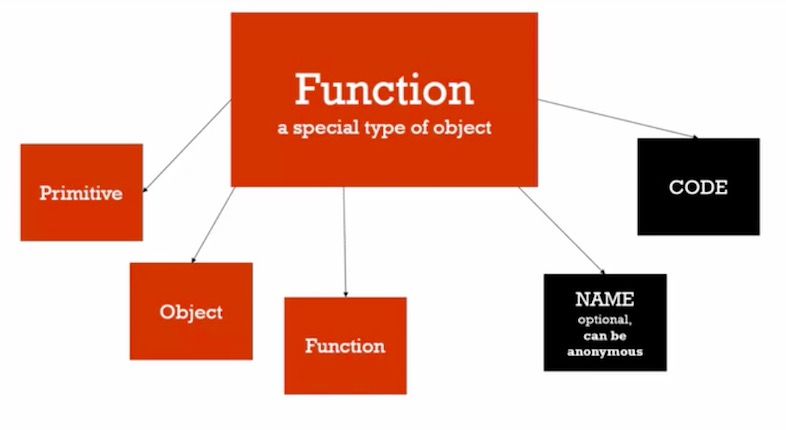
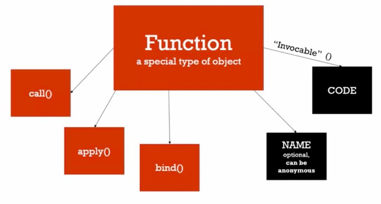

# Objects and functions


## Objects and the dot

Objects has three types of properties

+ Primitive "property"
+ Object "property"
+ Function "mothoed"

person["firstname]  ---- >   [] is an operator
person.firstname -->  . is an operator


## Objects and object literals

Creating objects on the fly and pass it to function


## Framework aside  -- Faking namespaces


Namespace: a container for variables and funtions

typically to keep variables and functions with the same name separate


## JSON and object literal


json notation is insprre by javascript object literal

propery has to be inside "" quotes

subset of js object literal

JSON.stringify()
JSON.parse() 

JSON object is built with javascript


## Functions are objects

First Class functions: everything you can do with other types you can go with functions.

Assign thme to variable, pass them around and even create theme on the fly





Functions can have no name, but you can assign them to variables for later reference.


## Function statement and function expression


Expression: a unit of code that result in a value

It doesnt have to save to a variable


function greet(){
  console.log("hi");
 }
 
 function statement
 
 anonymousGreet();  --> undefinded is not a function
 
 var anonymousGreet = function(){
   console.log('this is an function expression');
 }
 
 
 fucntional programming
 
 

##  By value or by reference


Primitive value

mutate: to change something

"Immutable" means it can't be changed.


primitive values are save the value, objects are by reference.


## Objects, functions and 'this'


## Array, collections of anything


## Arguments and spread


arguments will be deprecated

Arguments: the parameters you pass to a function

Javascript gives you a keyword of the same name which contains them all.


## Function overloading


## Syntax Parsers


## Danger: Automatic semicolon insertion


## Framework aside: whitespace


 Whitespace: invisible characters that create literal 'space' in your writing code
 
 Carriage returns, tabs, spaces.
 
 
 
 
 
 

##  Functions and IFFE


controversy


## Framework: IFFE and safe code


## Closure: 


## Framework aside : function factories


```
function makeGreeting(language){
  return function(firstname, lastname){
    if(language === 'en'){
      console.log('Hello ' + firstname + ' ' + lastname);
    }
    
    if (language === 'es'){
      console.log('Hola' + firstname + ' ' + lastname);
    }
  }
}

var greetEnglish = makeGreeting('en');
var greetSpanish = makeGreeting('es');

greetEnglish('Jone', 'done')
greetgreetSpanish('Jone', 'done')
```

Everytime you call a function, you'll get new exuetion context


## Closures and callbacks


## Big word alert

**Callback function**: A function you give to another function, to be run when other function is finished

So the function you call(i.e.invoke), 'calls back' by calling the function you gave it when it finishes.


## Call(), apply() and bind()

Control what ```this``` is bound to




bind() crates a copy of the function and bind the ```this``` 
call() actually executes it
apply() does the same, but it want a array of parameters, rather than just the normal list


### Usage

**Function borrowing**

**Function currying**

You don't care about what the this keyword is in this case, you're not using the ```this``` keyword.

**Function currying**: Creating a copy of a function but with some preset parameters

Very useful in mathematical situations.


apply and call  ,   a for array, c for comma


## Functonal programing


**Having first class functions in a Javascript programming language means we can implement what's called functional programming where we think and code in terms of functions**

Think about how to can give functions to your functions and return functions from your functions in order to simplify your code

**Spliting things into functions and passing them around**

Functional programming will take your javascript to the next level


## Functional programming part 2 -- example


underscore.js

lodash.js

**Open source education**

